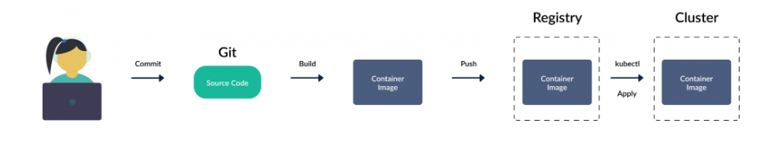

# Capítulo 1

## O que é GitOps?

Sabe quando você coloca uma panela de angu com queijo na geladeira e <b>outra pessoa come?</b> 

    

Imagina como seria bom se mesmo quando outra pessoa comesse ela voltasse <b>automagicamente</b> pra geladeira da mesma forma que você deixou. De forma muito simplificada este é um dos benefícios ao utilizar <b>GitOps</b>.

    

Obviamente GitOps é um tema que aborda mais princípios do que essa analogia em si retrata, porém ela é um bom norte para entender os seus benefícios. Nos parágrafos seguintes você possivelmente irá entender melhor o que a analogia do angu com queijo quer dizer.

Os princípios do GitOps são:

*   Um sistema gerenciado por GitOps deve ser descrito de forma totalmente declarativa ( Infraestrutura e Aplicação )

*   O estado desejado do sistema é versionado no Git

*   Mudanças aprovadas são automaticamente aplicadas

*   Agentes devem garantir sincronismo contínuo entre o ambiente criado e o estado desejado

Vamos ver com um pouco mais de detalhe cada um desses pontos.

### Declarativo

O princípio básico do GitOps é que toda aplicação e componentes necessários para sua execução devem estar descritos via Git. O <b>estado desejado</b> deve ser aquele que está no repositório Git.

### Versionado e imutável

Um commit do git é uma excelente forma de se ter um snapshot imultável de toda uma hierarquia de arquivos, e isso o torna o armazenamento ideal para se utilizar em GitOps. Toda alteração feita no git automaticamente substitui <b>todo o estado anterior</b> ao invés de somente realizar apenas uma mudança, e sempre que essa substituição acontece é criada uma nova versão do estado.

    

### Pull automático

O caminho típico de uma atualização de ambiente é que o desenvolvedor faça um commit e envie as modificações para produção.

    

Porém com GitOps o caminho é o contrário. Em GitOps existe um <b>agente</b> que intermedia a interação entre o repositório git e o ambiente de produção, onde esse agente escuta por qualquer alteração no repositório da aplicação e mescla essas atualizações no ambiente de produção.

    

### Continuamente sincronizado

Mudanças nos sistemas são constantes, e com isso existe a necessidade de se validar continuamente o estado das aplicações em produção para que elas reflitam o que está descrito no git.

    

O agente de GitOps é responsável por monitorar de tempos em tempos o estado das aplicações no ambiente de produção e comparar com o estado desejado armazenado no git. Essa ação automática de sincronismo além de evitar a persistência de alterações feitas diretamente no ambiente de produção nos dá a garantia de que para saber o que está sendo executado em produção basta olhar o que está no git.

 

<b><i>Quando houver diferença entre o estado desejado e o ambiente de produção, eu vou estar lá.</i></b>

    

## Casos de uso

## Prós e contras

## Preparando ambiente de estudo

## Referências e recomendações

Este primeiro capítulo foi baseado no conteúdo gratúito do curso <a href="https://learning.codefresh.io/course/gitops-fundamentals" >GitOps Fundamentals</a> disponibilizado pela Codefresh.

Você também pode encontrar bastante informação sobre GitOps no site da <a href="https://opengitops.dev/" >Open GitOps</a>